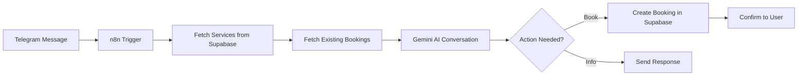

# n8n Workflow: Telegram Booking Bot

## Overview
This workflow connects a Telegram bot to your Supabase database to handle service bookings automatically using Gemini AI for natural conversations.

## Architecture



## Prerequisites

1. **Telegram Bot Token**
   - Talk to [@BotFather](https://t.me/botfather) on Telegram
   - Send `/newbot` and follow instructions
   - Copy your bot token (looks like: `123456:ABC-DEF1234ghIkl-zyx57W2v1u123ew11`)

2. **Supabase Credentials**
   - Supabase URL: `https://your-project.supabase.co`
   - Supabase Anon Key (from Supabase Dashboard → Settings → API)
   - Service Role Key (for bypassing RLS in n8n)

3. **Gemini API Key**
   - Get from [Google AI Studio](https://aistudio.google.com/app/apikey)

## n8n Workflow Setup

### Node 1: Telegram Trigger
```json
{
  "name": "Telegram Trigger",
  "type": "n8n-nodes-base.telegramTrigger",
  "parameters": {
    "updates": ["message"]
  },
  "credentials": {
    "telegramApi": {
      "accessToken": "YOUR_TELEGRAM_BOT_TOKEN"
    }
  }
}
```

### Node 2: Get Salon Config
**Purpose**: Fetch the salon configuration (you'll need the salon_config_id)

```json
{
  "name": "Get Salon Config",
  "type": "n8n-nodes-base.supabase",
  "parameters": {
    "operation": "getAll",
    "tableId": "salon_configs",
    "returnAll": false,
    "limit": 1,
    "filterType": "manual",
    "matchType": "allFilters",
    "filters": {
      "conditions": [
        {
          "keyName": "is_active",
          "condition": "equals",
          "keyValue": "true"
        }
      ]
    }
  },
  "credentials": {
    "supabaseApi": {
      "host": "https://your-project.supabase.co",
      "serviceRole": "YOUR_SERVICE_ROLE_KEY"
    }
  }
}
```

### Node 3: Get Available Services
```json
{
  "name": "Get Services",
  "type": "n8n-nodes-base.supabase",
  "parameters": {
    "operation": "getAll",
    "tableId": "salon_services",
    "returnAll": true,
    "filterType": "manual",
    "matchType": "allFilters",
    "filters": {
      "conditions": [
        {
          "keyName": "salon_config_id",
          "condition": "equals",
          "keyValue": "={{ $json.id }}"
        },
        {
          "keyName": "is_active",
          "condition": "equals",
          "keyValue": "true"
        }
      ]
    }
  }
}
```

### Node 4: Get Today's Bookings
```json
{
  "name": "Get Bookings",
  "type": "n8n-nodes-base.supabase",
  "parameters": {
    "operation": "getAll",
    "tableId": "bookings",
    "returnAll": true,
    "filterType": "manual",
    "matchType": "allFilters",
    "filters": {
      "conditions": [
        {
          "keyName": "salon_config_id",
          "condition": "equals",
          "keyValue": "={{ $('Get Salon Config').item.json.id }}"
        },
        {
          "keyName": "booking_date",
          "condition": "equals",
          "keyValue": "={{ $today.format('YYYY-MM-DD') }}"
        },
        {
          "keyName": "status",
          "condition": "isIn",
          "keyValue": "pending,confirmed"
        }
      ]
    }
  }
}
```

### Node 5: Prepare Context for Gemini
**Purpose**: Format services and bookings data for the AI

```javascript
// Code Node
const services = $('Get Services').all().map(item => ({
  name: item.json.service_name,
  price: item.json.price,
  duration: item.json.duration_minutes
}));

const bookedSlots = $('Get Bookings').all().map(item => 
  `${item.json.booking_time} (${item.json.duration_minutes} دقيقة)`
);

const salonConfig = $('Get Salon Config').first().json;

return [{
  json: {
    services: services,
    bookedSlots: bookedSlots,
    workingHours: salonConfig.working_hours,
    agentName: salonConfig.agent_name || 'سارة',
    specialty: salonConfig.specialty || 'شامل'
  }
}];
```

### Node 6: Gemini AI Conversation
```json
{
  "name": "Gemini Chat",
  "type": "n8n-nodes-base.httpRequest",
  "parameters": {
    "method": "POST",
    "url": "https://generativelanguage.googleapis.com/v1beta/models/gemini-2.0-flash-exp:generateContent",
    "authentication": "genericCredentialType",
    "genericAuthType": "httpQueryAuth",
    "queryParameters": {
      "parameters": [
        {
          "name": "key",
          "value": "YOUR_GEMINI_API_KEY"
        }
      ]
    },
    "sendBody": true,
    "bodyParameters": {
      "parameters": [
        {
          "name": "contents",
          "value": "={{ JSON.stringify([{ role: 'user', parts: [{ text: $('Telegram Trigger').item.json.message.text }] }]) }}"
        },
        {
          "name": "systemInstruction",
          "value": "={{ JSON.stringify({ parts: [{ text: `أنت ${$('Prepare Context').item.json.agentName}، موظفة استقبال في صالون ${$('Prepare Context').item.json.specialty}.\n\nالخدمات المتاحة:\n${$('Prepare Context').item.json.services.map(s => `- ${s.name}: ${s.price} ريال (${s.duration} دقيقة)`).join('\\n')}\n\nساعات العمل: ${$('Prepare Context').item.json.workingHours.start} - ${$('Prepare Context').item.json.workingHours.end}\n\nالأوقات المحجوزة اليوم: ${$('Prepare Context').item.json.bookedSlots.join(', ') || 'لا يوجد'}\n\nمهمتك:\n1. الترحيب بالعميلة بأسلوب ودود\n2. عرض الخدمات المتاحة\n3. مساعدتها في اختيار الوقت المناسب\n4. تأكيد الحجز\n\nعند تأكيد الحجز، استخدم هذا التنسيق بالضبط:\n[BOOKING]\nاسم العميلة: ...\nرقم الهاتف: ...\nالخدمة: ...\nالتاريخ: YYYY-MM-DD\nالوقت: HH:MM\n[/BOOKING]` }] }) }}"
        }
      ]
    }
  }
}
```

### Node 7: Extract Booking Info
**Purpose**: Parse Gemini response to check if booking was confirmed

```javascript
// Code Node
const response = $input.item.json.candidates[0].content.parts[0].text;

// Check if response contains booking confirmation
const bookingMatch = response.match(/\[BOOKING\]([\s\S]*?)\[\/BOOKING\]/);

if (bookingMatch) {
  const bookingText = bookingMatch[1];
  const nameMatch = bookingText.match(/اسم العميلة:\s*(.+)/);
  const phoneMatch = bookingText.match(/رقم الهاتف:\s*(.+)/);
  const serviceMatch = bookingText.match(/الخدمة:\s*(.+)/);
  const dateMatch = bookingText.match(/التاريخ:\s*(\d{4}-\d{2}-\d{2})/);
  const timeMatch = bookingText.match(/الوقت:\s*(\d{2}:\d{2})/);

  // Find matching service
  const services = $('Get Services').all();
  const selectedService = services.find(s => 
    s.json.service_name === serviceMatch[1].trim()
  );

  return [{
    json: {
      hasBooking: true,
      customerName: nameMatch[1].trim(),
      customerPhone: phoneMatch[1].trim(),
      serviceId: selectedService?.json.id,
      serviceName: serviceMatch[1].trim(),
      bookingDate: dateMatch[1],
      bookingTime: timeMatch[1],
      durationMinutes: selectedService?.json.duration_minutes || 60,
      response: response.replace(/\[BOOKING\][\s\S]*?\[\/BOOKING\]/, '').trim()
    }
  }];
} else {
  return [{
    json: {
      hasBooking: false,
      response: response
    }
  }];
}
```

### Node 8: IF - Check if Booking Needed
```json
{
  "name": "IF Booking",
  "type": "n8n-nodes-base.if",
  "parameters": {
    "conditions": {
      "boolean": [
        {
          "value1": "={{ $json.hasBooking }}",
          "value2": true
        }
      ]
    }
  }
}
```

### Node 9: Create Booking in Supabase
```json
{
  "name": "Create Booking",
  "type": "n8n-nodes-base.supabase",
  "parameters": {
    "operation": "create",
    "tableId": "bookings",
    "fieldsUi": {
      "fieldValues": [
        {
          "fieldId": "salon_config_id",
          "fieldValue": "={{ $('Get Salon Config').item.json.id }}"
        },
        {
          "fieldId": "service_id",
          "fieldValue": "={{ $json.serviceId }}"
        },
        {
          "fieldId": "customer_name",
          "fieldValue": "={{ $json.customerName }}"
        },
        {
          "fieldId": "customer_phone",
          "fieldValue": "={{ $json.customerPhone }}"
        },
        {
          "fieldId": "booking_date",
          "fieldValue": "={{ $json.bookingDate }}"
        },
        {
          "fieldId": "booking_time",
          "fieldValue": "={{ $json.bookingTime }}"
        },
        {
          "fieldId": "duration_minutes",
          "fieldValue": "={{ $json.durationMinutes }}"
        },
        {
          "fieldId": "status",
          "fieldValue": "confirmed"
        },
        {
          "fieldId": "created_by",
          "fieldValue": "telegram_bot"
        }
      ]
    }
  }
}
```

### Node 10: Send Response to Telegram
```json
{
  "name": "Send Message",
  "type": "n8n-nodes-base.telegram",
  "parameters": {
    "resource": "message",
    "operation": "sendMessage",
    "chatId": "={{ $('Telegram Trigger').item.json.message.chat.id }}",
    "text": "={{ $('Extract Booking Info').item.json.response }}"
  }
}
```

## Testing Steps

1. **Start the workflow** in n8n
2. **Find your bot** on Telegram (search for the username you created)
3. **Send a message**: "مرحبا، أريد حجز موعد"
4. **Follow the conversation** - the bot should:
   - Greet you
   - Show available services
   - Ask for preferred time
   - Confirm the booking
5. **Check `/bookings`** in your app - the booking should appear!

## Troubleshooting

- **Bot not responding**: Check if workflow is active
- **Services not showing**: Verify `salon_config_id` exists and has services
- **Booking not created**: Check Supabase RLS policies and service role key
- **Gemini errors**: Verify API key and quota

## Next Steps

- Add WhatsApp integration (replace Telegram trigger)
- Implement booking cancellation
- Add reminder notifications
- Multi-language support
